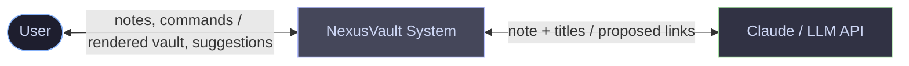
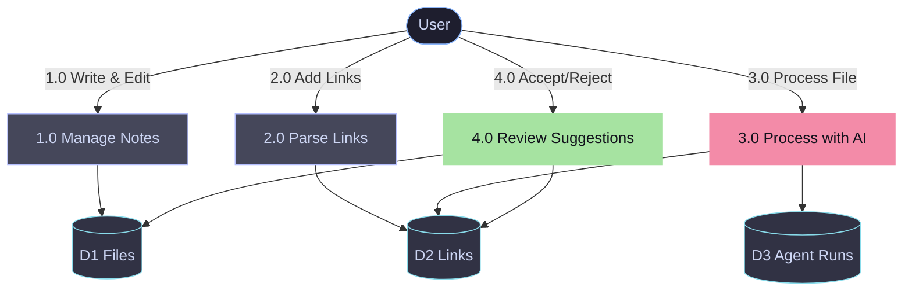

<div align="center">

<br/>

<h1 align="center">⚡ NexusVault</h1>

<p align="center">
  <strong>An AI-Native Knowledge Vault — capture unstructured notes freely, and let an AI agent discover and propose contextual relationships between them.</strong>
</p>

<p align="center">
  <em>Department of Computer Science & Engineering (AI/ML) · Academic Year 2026–27 · Semester Project</em>
</p>

<br/>

<p align="center">
  &nbsp;
  &nbsp;
  &nbsp;
  &nbsp;
  
</p>

<p align="center">
  <a href="#1-problem-statement">Problem Statement</a>&ensp;·&ensp;
  <a href="#2-requirement-gathering">Requirements</a>&ensp;·&ensp;
  <a href="#3-data-flow-diagrams">Data Flow Diagrams</a>&ensp;·&ensp;
  <a href="#4-technologies-used">Tech Stack</a>&ensp;·&ensp;
  <a href="#5-link-syntax--grammar">Link Syntax</a>&ensp;·&ensp;
  <a href="#6-quick-start">Quick Start</a>&ensp;·&ensp;
  <a href="#7-design-philosophy">Philosophy</a>
</p>

</div>

---

## 1. Problem Statement

Knowledge workers, students, and researchers accumulate large volumes of notes across subjects, but organizing this information — tagging, linking, and structuring it — requires continuous manual effort. Most note-taking tools force a choice between two unsatisfying extremes: **rigid structure imposed at capture time** (which discourages quick, messy note-taking) or **no structure at all** (which makes older notes increasingly hard to rediscover and connect as the collection grows).

> 💡 **CORE PROBLEM**  
> There is no lightweight system that allows a user to capture knowledge in its cheapest, least structured form at the moment of learning, and later have that knowledge automatically organized into a connected, navigable structure without manual linking effort.

### 1.1 Why Existing Tools Fall Short

| Tool Category | What happens in practice | Why it falls short |
|---|---|---|
| **Obsidian / Traditional PKM** | Manual wikilinking (`[[Note]]`) | Linking is entirely manual; the user must remember and create every connection themselves. |
| **Generic AI Chat Tools** | Pasting notes into ChatGPT | Summarizes or answers questions about a note, but fails to persist structure back into a personal knowledge base. |
| **Plain Note Apps** | Notion, Google Keep | Offers folders and tags, but lacks relationship-aware linking and automated connection discovery. |

### 1.2 Proposed Solution

**NexusVault** lets users write notes in plain Markdown using an Obsidian-style editor, supporting both **plain links** (`[[Note]]`) and **typed contextual links** (`[[Note | relationship | context]]`). 

At any point, the user can invoke an AI agent on a note (**"Process File"**), which reads the note content alongside all titles in the vault to propose new contextual relationships. The user reviews and **accepts** or **rejects** each suggestion, keeping a human in the loop while removing the manual burden of link discovery.

---

## 2. Requirement Gathering

### 2.1 Functional Requirements

| ID | Requirement | Description | Priority |
|:---|:---|:---|:---:|
| **FR-01** | Create / Edit / Delete Notes | User can create, edit, and delete Markdown notes within a vault. | <span style="color:#ef4444; font-weight:bold;">High</span> |
| **FR-02** | Plain Linking | User can link one note to another using `[[Note Title]]` syntax. | <span style="color:#ef4444; font-weight:bold;">High</span> |
| **FR-03** | Contextual Linking | User can create typed links with relationship and context metadata using `[[Note \| relation \| context]]`. | <span style="color:#ef4444; font-weight:bold;">High</span> |
| **FR-04** | Backlink Panel | System displays all notes linking to the currently open note. | <span style="color:#eab308; font-weight:bold;">Medium</span> |
| **FR-05** | Graph View | System renders a visual, navigable graph of the current note's link neighborhood. | <span style="color:#eab308; font-weight:bold;">Medium</span> |
| **FR-06** | AI Process File | User can trigger an AI agent to analyze the current note and propose new contextual links to existing notes. | <span style="color:#ef4444; font-weight:bold;">High</span> |
| **FR-07** | Accept / Reject Suggestions | User can review each AI-proposed link and accept (persist) or reject (discard) it. | <span style="color:#ef4444; font-weight:bold;">High</span> |
| **FR-08** | File Navigation | User can browse and switch between notes via a file tree / quick-switcher (`Cmd+K`). | <span style="color:#eab308; font-weight:bold;">Medium</span> |

### 2.2 Non-Functional Requirements

| Category | Requirement |
|:---|:---|
| **Performance** | AI processing of a single note returns suggestions within 5–8 seconds under normal API latency. |
| **Usability** | Editor interactions (typing, linking, saving) feel responsive, matching Obsidian's native editor experience. |
| **Reliability** | The system degrades gracefully if the AI API call fails — notes and existing links remain unaffected. |
| **Data Integrity** | Markdown content is the single source of truth; the links table is always re-derivable from it. |
| **Scalability** | Handles vaults of up to a few hundred notes without noticeable slowdown in the demo environment. |
| **Maintainability** | Backend logic (parsing, tool schema, agent call) is modular and independently testable. |

### 2.3 User Stories

* **As a student**, I want to write a quick, unstructured note during a lecture so that I don't lose time worrying about organization.
* **As a returning user**, I want the system to suggest how a new note connects to my older notes so that my knowledge base stays navigable as it grows.
* **As a careful user**, I want to review every AI-suggested link before it becomes permanent so that I retain complete control over my knowledge base.

---

## 3. Data Flow Diagrams

### 3.1 Level 0 DFD (Context Diagram)



*Figure 1: Level 0 DFD showing the User, the NexusVault system, and the external LLM API as the three high-level actors.*

### 3.2 Level 1 DFD (Process Breakdown)



*Figure 2: Level 1 DFD decomposing the system into four core processes against three data stores (Files, Links, Agent Runs).*

---

## 4. Technologies Used

### 4.1 Frontend Architecture

| Layer | Technology | Description |
|:---|:---|:---|
| **Runtime** | Node.js | JavaScript runtime powering build tooling and development server. |
| **Framework** | React 18 (Vite) | Component-based UI for editor, file tree, graph, and backlinks inspector. |
| **Editor** | CodeMirror 6 | Markdown editing surface with custom inline syntax highlighting for links. |
| **Styling** | Tailwind CSS | Utility-first styling configured for an authentic Obsidian dark theme. |
| **Visualization** | react-force-graph | Force-directed 2D graph rendering note relationship neighborhoods. |
| **HTTP Client** | Fetch API | Communicates with the REST backend for CRUD and AI operations. |

### 4.2 Backend & Data Layer

| Layer | Technology | Description |
|:---|:---|:---|
| **Framework** | Express (Node.js) | REST API handling note CRUD, link parsing, and agent orchestration. |
| **Database** | SQLite | Lightweight relational store for `files`, `links`, and `agent_runs`. |
| **AI / LLM** | Anthropic Claude API | Tool-calling LLM (`propose_link`) analyzing notes and suggesting links. |

### 4.3 Development & Tooling

| Tool | Purpose |
|:---|:---|
| **Git & GitHub** | Version control and source code hosting. |
| **npm** | Package management for all Node.js backend and frontend dependencies. |
| **VS Code** | Primary development environment. |

---

## 5. Link Syntax & Grammar

NexusVault supports two tiers of link syntax:

### Plain Link (Standard Obsidian)
```markdown
[[Neural Networks]]
```

### Contextual Link (Semantic Metadata)
```markdown
[[Backpropagation | relies_on | Uses multivariable chain rule for weight derivatives]]
```

```
   ┌───────────────┐     ┌───────────────┐     ┌──────────────────────────────────────────────┐
   │ Target Title  │  |  │ Relationship  │  |  │ Context Explanation                          │
   │ "Statistics"  │  |  │ "prereq_for"  │  |  │ "Z-score depends on mean & std deviation"   │
   └───────────────┘     └───────────────┘     └──────────────────────────────────────────────┘
```

> **Parser Rule:**  
> Split on `|`. 1 segment = Plain Link (`target_title`). 3 segments = Contextual Link (`target_title`, `relationship`, `context`). Anything else degrades gracefully to a plain link.

---

## 6. Quick Start

### 1. Clone & Install

```bash
git clone git@github.com:shubham2007p/Nexus_Vault.git
cd Nexus_Vault
npm install
```

### 2. Environment Setup

Create `.env` in the root directory:

```env
PORT=3001
ANTHROPIC_API_KEY=your_anthropic_api_key_here
```
*(If no API key is set, NexusVault defaults to its intelligent heuristic engine for link proposals).*

### 3. Run the Application

```bash
npm start
```

Runs concurrently:
- **Express Backend**: `http://localhost:3001`
- **Vite React UI**: `http://localhost:5173`

---

## 7. Design Philosophy

**`[1]` Markdown is the Source of Truth.**  
Links are parsed out of `content` on save and mirrored into SQLite. If they ever disagree, re-parse from markdown — markdown wins, always.

**`[2]` Substance Before Noise.**  
No prompt-injection fluff or multi-step agent loops. One single-shot tool call that proposes real, semantic connections.

**`[3]` Human-in-the-Loop Control.**  
AI proposes, human disposes. Suggested links remain pending until accepted by the user.

---

## 📜 License

NexusVault is **source-available**, not open-source.

```
✅ Personal use          ✅ Educational use       ✅ Research
✅ View & study code     ✅ Fork to contribute    ❌ Redistribute
❌ Commercial use        ❌ Resell / sublicense   ❌ Independent forks
```

---

<div align="center">

*Built with focus by <a href="https://github.com/shubham2007p">@shubham2007p</a> — 2026*

`●` *Connecting ideas, node by node.*

</div>
